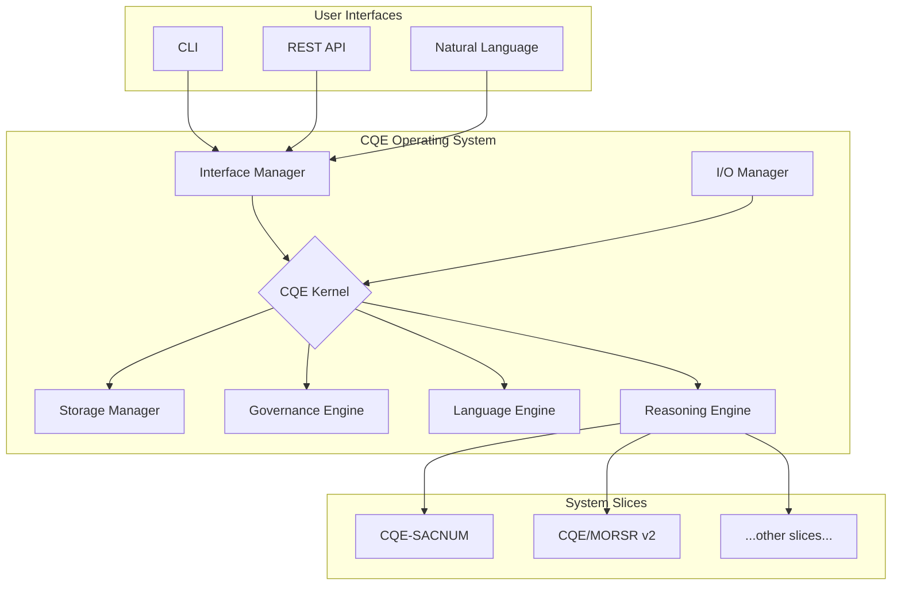
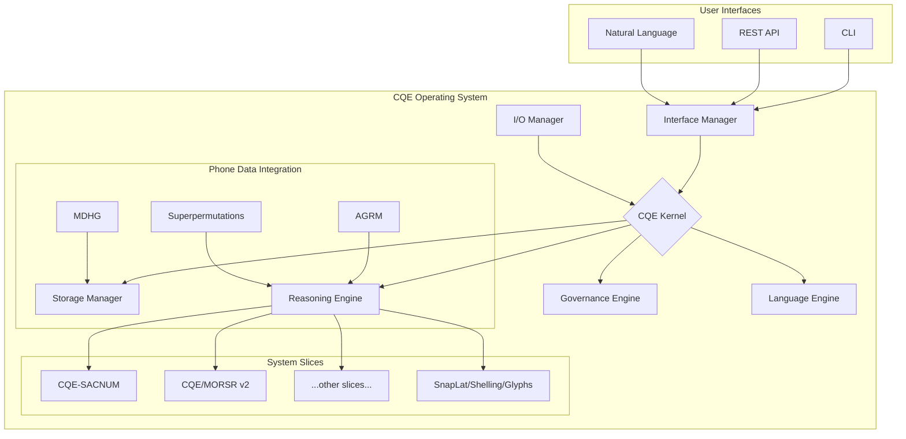

# CQE System Architecture

This document outlines the unified architecture of the Cartan Quadratic Equivalence (CQE) system, integrating concepts from the provided CQE system files and phone data. The architecture is designed around the core principle of "geometry first, meaning second," with the E8 lattice serving as the fundamental geometric substrate.

## Core Concepts

The CQE system is a universal computing paradigm that represents all data as high-dimensional geometric "atoms." These atoms are processed through a series of mathematical frameworks, or "slices," that analyze their geometric properties. Semantic meaning is then extracted from the resulting geometric patterns.

Key concepts include:

*   **E8 Lattice:** An 8-dimensional lattice with 240 root vectors, providing a universal coordinate system for all data.
*   **Sacred Geometry:** The application of number-pattern principles (digital roots, sacred frequencies) to guide computations.
*   **Mandelbrot Fractals:** The use of fractal geometry for data compression and analysis.
*   **Toroidal Geometry:** The modeling of data as points on a 3D torus to analyze forces and resonances.
*   **Universal Atom:** A unified data model that encapsulates all geometric and mathematical properties of a piece of data.

## System Components

The CQE Operating System is composed of the following core components:

| Component | Description |
| :--- | :--- |
| **CQE Kernel** | The central orchestrator of the system, responsible for all E8 lattice operations. |
| **Storage Manager** | Manages the persistence of CQE atoms, with support for multiple backends. |
| **Governance Engine** | Enforces system-wide constraints and policies, ensuring mathematical and geometric consistency. |
| **Language Engine** | Processes and translates human language into the CQE's universal syntax. |
| **Reasoning Engine** | Performs advanced logic and inference based on the geometric relationships between CQE atoms. |
| **I/O Manager** | Transforms data between external formats and the internal CQE representation. |
| **Interface Manager** | Provides multiple interfaces for interacting with the system, including CLI, REST API, and natural language. |

## System Slices

The CQE system is composed of multiple "slices," each representing a specific functional module. The following slices have been identified from the provided documents:

*   **CQE-SACNUM:** Sacred Numerology
*   **CQE/MORSR v2:** Gauge-Pose Ledger Build
*   **CQE-KOLMOGOROV:** MDL, Description-Length & Compressor Ensembles
*   **CQE-SPECTRAL:** Graph Laplacian, Eigenroutes & Rayleigh Gates
*   **CQE-TDA:** Persistent Homology, Barcodes & Filtration Governance
*   **CQE-LANDAU:** Phase Transitions & Critical Bands
*   **CQE-TESLA:** Resonance Coupling Channels
*   **CQE-MAXWELL-BOLTZ:** Entropic Routing
*   **CQE-EULER:** Generating-Function Governance
*   **CQE-GAME:** Regret Minimization, Equilibria & Payoff Potentials
*   **CQE-CLIFFORD:** Geometric Algebra, Reflections & Spinor Flows
*   **CQE-GAUGE:** Connections, Curvature & Wilson-Loop Witnesses
*   **CQE-KNOT:** Links, Invariants & Chern-Simons Routing

## Architectural Diagram

## Data Flow and Processing

The CQE system processes data in a sequential pipeline, starting with geometric encoding and ending with semantic extraction. This "geometry first, meaning second" approach ensures that all operations are grounded in a consistent and verifiable mathematical framework.

1.  **Ingestion and Atomization:** All incoming data, regardless of its original format (text, images, etc.), is ingested by the I/O Manager and transformed into a **CQE Atom**. This process, known as atomization, involves encoding the data's fundamental properties into a standardized geometric representation.

2.  **Geometric Encoding:** The CQE Atom is then processed by a series of geometric encoders:
    *   **Quad Encoding:** A 4-dimensional representation capturing the data's basic structure.
    *   **E8 Embedding:** The data is embedded into the 8-dimensional E8 lattice, providing a universal coordinate system.
    *   **Parity Channels:** 8 channels of error-correction data are generated to ensure geometric consistency.

3.  **Governance and Validation:** The Governance Engine validates the CQE Atom against a set of system-wide constraints and policies. This ensures that all data conforms to the CQE's mathematical and geometric principles.

4.  **Processing and Reasoning:** The CQE Kernel, in conjunction with the Reasoning Engine and various system slices, performs computations and analysis on the CQE Atom. These operations are all performed within the E8 geometric space.

5.  **Semantic Extraction:** Finally, the Language Engine extracts semantic meaning from the geometric patterns and relationships identified during processing. This meaning is then presented to the user through the Interface Manager.

## Integration of Phone Data Concepts

The concepts and data from the "phone data" files can be integrated into the CQE system as follows:

*   **SnapLat, Shelling, and Glyphs:** These concepts from the phone data can be implemented as a specialized set of system slices within the CQE framework. The SnapLat system, with its use of E8 for indexing and relating snaps/glyphs, aligns perfectly with the CQE's core architecture.
*   **AGRM & MDHG:** The Advanced Golden Ratio Modulation/Method (AGRM) and Multi-Dimensional Hamiltonian Golden (MDHG) can be integrated as part of the Reasoning Engine and Storage Manager, respectively. MDHG's hierarchical clustering and AGRM's phi-modulated traversal would provide advanced capabilities for data organization and retrieval.
*   **Superpermutations:** The superpermutation logic can be incorporated into the Reasoning Engine to provide a coverage-first approach to exploring decision branches and generating candidate solutions.

## Unified Architectural Diagram

## Geometric Governance

The CQE system is governed by a set of mathematical and geometric principles that ensure the integrity and consistency of all data and operations. This "geometric governance" is enforced by the Governance Engine, which operates at multiple levels of the system.

### Core Principles

The following core principles form the foundation of CQE's geometric governance:

*   **Geometry First, Meaning Second:** All data is first encoded into a geometric representation before any semantic meaning is extracted. This ensures that all operations are grounded in a consistent and verifiable mathematical framework.
*   **Universal Atomization:** All data is represented as a universal "CQE Atom," which encapsulates all of its geometric and mathematical properties.
*   **E8 Lattice as Universal Substrate:** The E8 lattice serves as the fundamental coordinate system for all data, providing a universal space for all computations and analysis.
*   **Invariance and Symmetry:** The system leverages the symmetries of the E8 lattice and other geometric structures to ensure that all operations are consistent and reproducible.

### Governance Mechanisms

The Governance Engine employs a variety of mechanisms to enforce these principles:

*   **Axioms and Invariants:** Each system slice is defined by a set of axioms and invariants that govern its behavior. The Governance Engine continuously monitors the system to ensure that these axioms and invariants are not violated.
*   **Parity Channels:** The 8 parity channels in each CQE Atom provide a robust error-correction mechanism that ensures the geometric integrity of the data.
*   **Consensus and Validation:** All promotions and significant operations require consensus from multiple independent overlays (e.g., E8, Leech, Fractal, Governance). This ensures that all decisions are validated against multiple mathematical frameworks.
*   **Ledgering and Provenance:** All operations are recorded in an append-only ledger, providing a complete and verifiable history of the system's state. This ensures that all actions are traceable and accountable.

